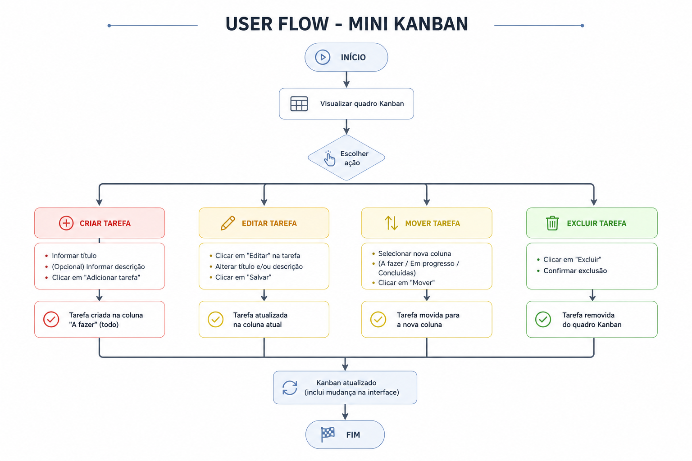

# Mini Kanban

Aplicação web de gerenciamento de tarefas desenvolvida como desafio Full Stack.

O projeto permite criar, visualizar, editar, movimentar e excluir tarefas através de uma interface Kanban.

## Tecnologias

### Frontend

- React
- Vite
- JavaScript
- CSS

### Backend

- Go
- `net/http`
- API REST
- JSON

## Funcionalidades

- Criar tarefas com título e descrição opcional
- Listar tarefas
- Editar tarefas
- Excluir tarefas
- Mover tarefas entre colunas
- Validação de título obrigatório
- Validação de status
- Feedback durante carregamento e operações
- Feedback de erros
- Estado vazio das colunas
- Interface responsiva

## Status das tarefas

As tarefas possuem três estados:

- `todo` — A fazer
- `doing` — Em progresso
- `done` — Concluídas

## Estrutura do projeto

```text
desafio-fullstack-veritas/
│
├── backend/
│   ├── go.mod
│   ├── handlers.go
│   ├── main.go
│   └── models.go
│
├── docs/
│   └── user-flow.png
│
├── frontend/
│   ├── public/
│   │   ├── favicon.svg
│   │   └── icons.svg
│   │
│   ├── src/
│   │   ├── assets/
│   │   ├── components/
│   │   │   ├── Column.jsx
│   │   │   ├── TaskCard.jsx
│   │   │   └── TaskForm.jsx
│   │   │
│   │   ├── services/
│   │   │   └── api.js
│   │   │
│   │   ├── App.css
│   │   ├── App.jsx
│   │   ├── index.css
│   │   └── main.jsx
│   │
│   ├── index.html
│   ├── package.json
│   └── vite.config.js
│
├── .gitignore
└── README.md
```

## Como executar

### Backend

Entre na pasta do backend:

```bash
cd backend
```

Execute:

```bash
go run .
```

O servidor será iniciado em:

```text
http://localhost:8000
```

### Frontend

Em outro terminal, entre na pasta do frontend:

```bash
cd frontend
```

Instale as dependências:

```bash
npm install
```

Execute o projeto:

```bash
npm run dev
```

O Vite exibirá no terminal o endereço local da aplicação, normalmente:

```text
http://localhost:5173
```

> O backend Go deve estar em execução para que o frontend consiga carregar e modificar as tarefas.

## API REST

A aplicação possui os seguintes endpoints:

### Listar tarefas

```http
GET /tasks
```

### Criar tarefa

```http
POST /tasks
```

Exemplo de requisição:

```json
{
  "title": "Estudar Go",
  "description": "Aprender API REST",
  "status": "todo"
}
```

### Atualizar tarefa

```http
PUT /tasks/:id
```

Exemplo de requisição:

```json
{
  "title": "Estudar Go",
  "description": "Criar uma API REST",
  "status": "doing"
}
```

### Excluir tarefa

```http
DELETE /tasks/:id
```

## Decisões técnicas

O frontend foi desenvolvido em React e organizado em componentes para facilitar a manutenção e a separação de responsabilidades.

- `TaskForm` é responsável pelo formulário de criação de tarefas.
- `Column` representa cada coluna do Kanban.
- `TaskCard` representa uma tarefa individual.
- `api.js` centraliza a comunicação do frontend com o backend.

O backend foi desenvolvido em Go utilizando o pacote padrão `net/http`, mantendo a aplicação simples e com poucas dependências.

A comunicação entre frontend e backend é realizada através de HTTP e JSON.

O armazenamento das tarefas é feito em memória, mantendo a implementação simples para o escopo do desafio.

O backend possui configuração de CORS para permitir a comunicação com o frontend durante o desenvolvimento local.

## Limitações conhecidas

- As tarefas são armazenadas somente em memória.
- Ao reiniciar o backend, as tarefas são perdidas.
- Não existe autenticação ou gerenciamento de usuários.
- O projeto ainda não possui testes automatizados.
- A movimentação das tarefas é feita através de botões, sem Drag and Drop.

## Melhorias futuras

- Persistência das tarefas em banco de dados
- Testes automatizados
- Implementação de Drag and Drop
- Autenticação e gerenciamento de usuários
- Filtros e busca de tarefas
- Containerização com Docker
- Deploy da aplicação em produção

## User Flow

O fluxo de utilização da aplicação é representado no diagrama abaixo:

